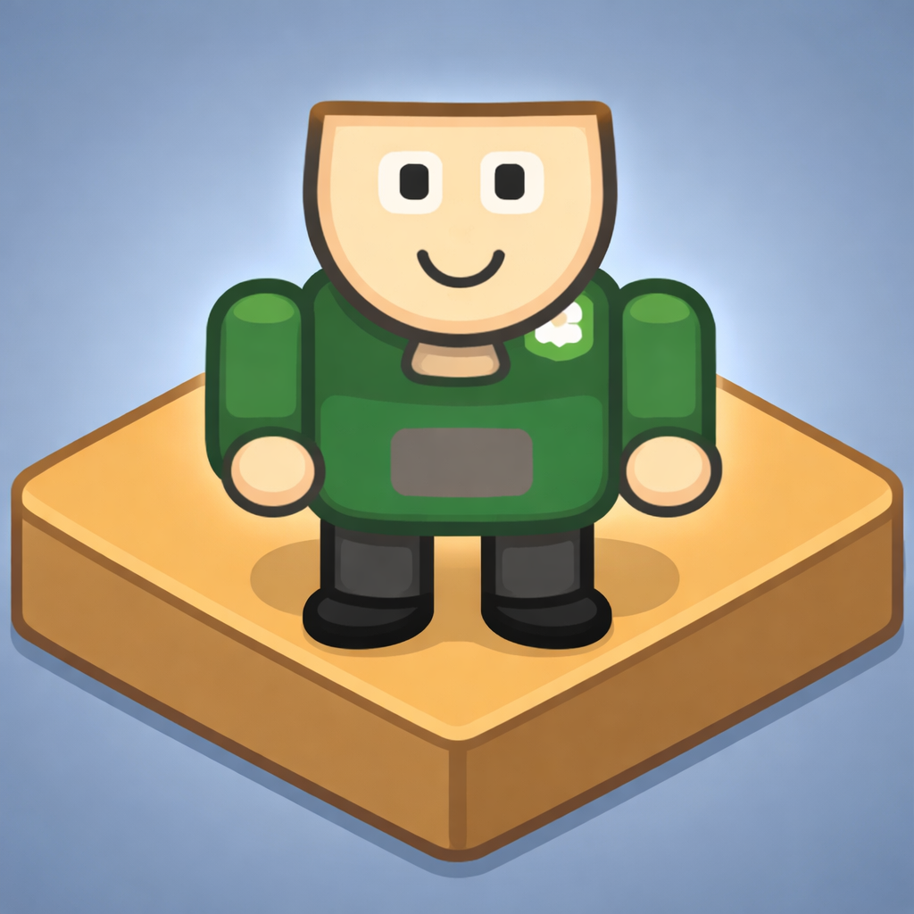
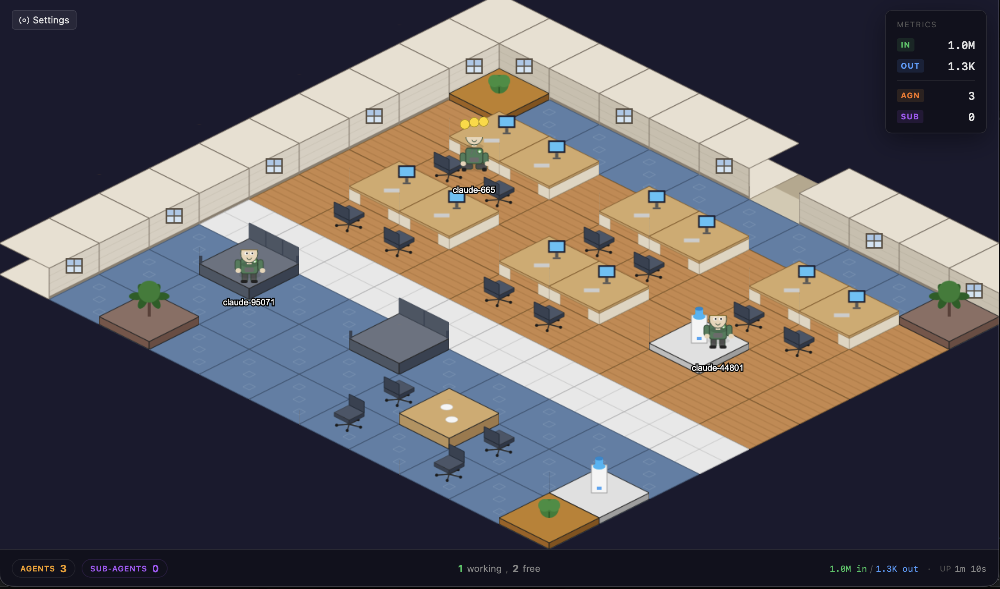
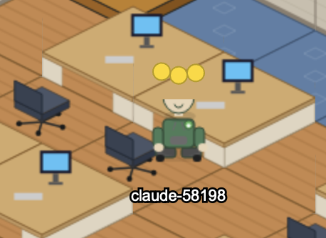
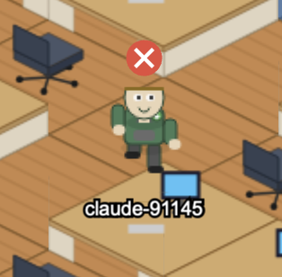
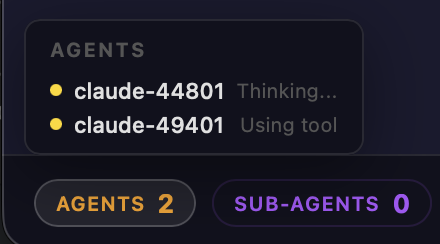
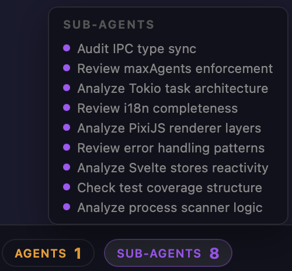
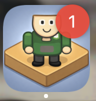
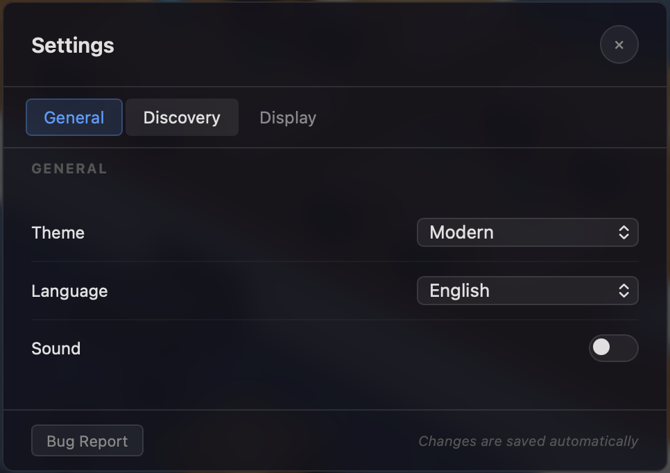
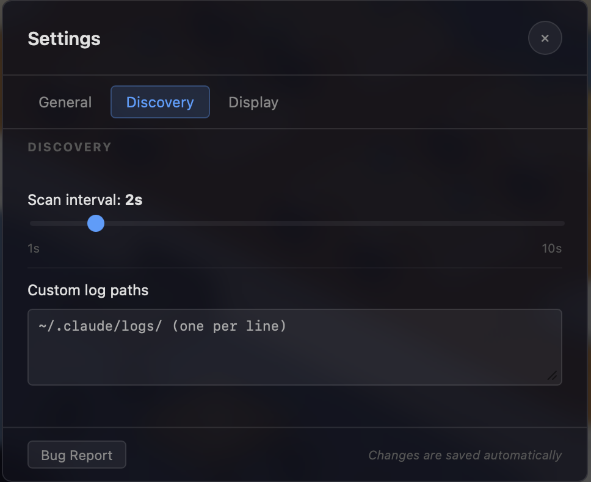
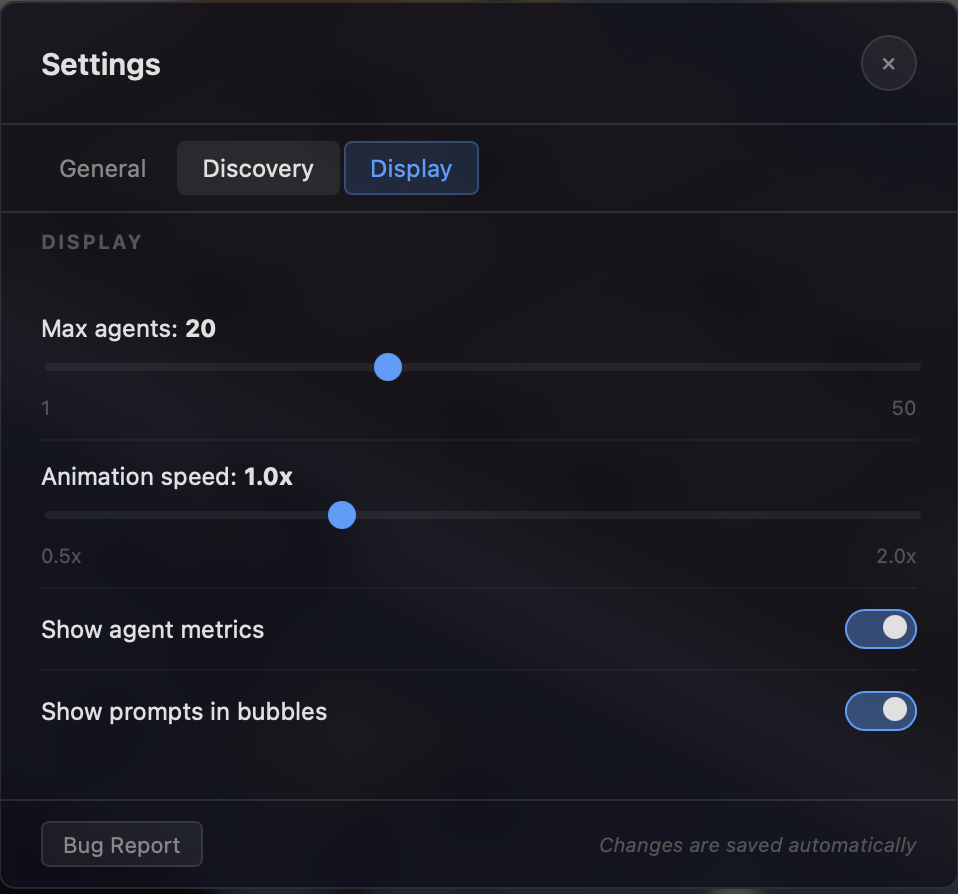

<p align="center">
  
</p>

<p align="center">
  
  
  
  
  
  
</p>

<h1 align="center">OfficeAI</h1>

<p align="center">
  <b>Desktop app that turns your AI agents into employees of a virtual isometric office</b>
</p>

<p align="center">
  Every running AI agent (Claude Code, Gemini CLI, Codex CLI, ChatGPT, ...) appears as an animated character in a 2D isometric office. Install, open — see all your agents in real time. Zero changes to your CLI workflow required.
</p>

---

## Contents

- [Quick Start](#quick-start)
- [Basic Usage](#basic-usage)
- [Concept](#concept)
- [App Tour](#app-tour)
- [How It Works](#how-it-works)
- [Model Tiers](#model-tiers)
- [Agent Lifecycle](#agent-lifecycle)
- [Idle Zones](#idle-zones)
- [Agent Discovery](#agent-discovery)
- [Troubleshooting](#troubleshooting)
- [Non-Goals](#non-goals)
- [Roadmap](#roadmap)
- [Commands](#commands)
- [Tech Stack](#tech-stack)
- [Cross-Platform Support](#cross-platform-support)
- [Documentation](#documentation)

---

## Quick Start

### Prerequisites

- [Node.js](https://nodejs.org/) >= 22
- [Rust](https://rustup.rs/) >= 1.75
- System dependencies for [Tauri v2](https://tauri.app/start/prerequisites/)

### Install & Run

```bash
make install
make dev
```

The app opens in a native 1280x800 window. The Rust backend automatically starts scanning processes and logs.

---

## Basic Usage

1. **Launch OfficeAI:** Start the app using `make dev` or open the installed binary.
2. **Run your AI Agent:** Open a **separate terminal** and start your preferred agent (e.g., `claude`, `gemini-cli`, or `codex`).
3. **Watch the Office:** OfficeAI will automatically detect the new process. An employee character will appear, walk to their assigned desk, and begin reflecting the agent's real-time state (thinking, typing, or using tools).
4. **Interact:** Hover over agents to see their latest response or click the status bar to see a full list of active employees.

---

## Concept

Each running AI agent is mapped to an animated office employee in a 2D isometric scene.

**Key principles:**

- **1 agent = 1 person** — each AI agent process maps to a virtual employee
- **Agent naming** — `{model name}-{PID}`, e.g. `claude-423235`, `gemini-23512`, `codex-54321`, `chatgpt-78901`
- **Open space** — every agent has a personal desk
- **Zero-intrusion** — the app never modifies or wraps CLI agents
- **Auto-discovery** — the system detects running agents automatically

---

## App Tour

A quick walkthrough of what you see when you use OfficeAI.

<p align="center"></p>

**Your AI agents, visualized as office employees.** When you open OfficeAI, you see a full isometric office floor. Each running AI agent occupies its own desk. The status bar at the bottom shows the total agent count, and the settings button is in the top-left corner.

<p align="center"></p>

**Bouncing balls mean the agent is busy.** Colored balls appear above an agent's head when it is actively thinking, responding, or using tools. The ball color reflects the model tier — gold for expert models, blue for senior, and so on.

<p align="center"></p>

**No balls — the agent is free.** When an agent finishes its task, the balls disappear and the character leaves its desk to roam the office — visiting the water cooler, sofa, or kitchen. The process is still running, just waiting for your next prompt.

<p align="center"></p>

**Speech bubbles show what agents are saying.** Hover over a working agent to see a preview of its response right inside the office, without switching to your terminal or browser.

<p align="center"></p>

**Cancellations are detected in real-time.** If you interrupt an agent's task in your terminal (Ctrl+C), OfficeAI detects this state change instantly. The agent stops its current activity and returns to its idle routine.

<p align="center"></p>

**Click the status bar to see all agents.** The agents panel lists every detected agent along with its current status — Thinking, Using tool, Responding, Idle, and more. Use it to quickly check who is busy and who is available.

<p align="center"></p>

**Sub-agents handle delegated work.** Click the SUB-AGENTS tab to see background tasks that a main agent has spawned. This gives you visibility into parallel work happening behind the scenes.

<p align="center"></p>

**The app icon shows the active agent count.** A red badge on your dock or taskbar icon tells you how many agents are currently working. One glance is enough to know if something is running — no need to open the app.

<p align="center"></p>

**General settings let you control core behavior.** Open Settings from the top-left gear icon. The General tab includes scan interval, animation speed, max agents, and other global preferences.

<p align="center"></p>

**Discovery settings configure how agents are found.** The Discovery tab controls process scanning parameters and log file monitoring for each supported agent type.

<p align="center"></p>

**Display settings customize the visual experience.** The Display tab adjusts office layout, zoom level, speech bubble behavior, and other rendering preferences.

---

## How It Works

OfficeAI operates on a **zero-intrusion** principle — it only observes AI agents, never interferes with their work.

```
OS Processes (sysinfo)          Agent log files
        │                                │
        ▼                                ▼
  Process Scanner (2s)          Log Watcher (500ms)
        │                                │
        └──────────┬─────────────────────┘
                   ▼
           Agent Registry ──► Tauri IPC Events
                   │
        ┌──────────┴──────────┐
        ▼                     ▼
   Svelte UI             PixiJS Renderer
   (overlay)             (isometric scene)
```

1. **Process Scanner** discovers AI agents via OS process list
2. **Log Watcher** reads agent log files for status changes
3. **State Classifier** (FSM with debounce) determines agent state
4. **Agent Registry** maintains state, emits Tauri IPC events, and updates the app icon badge
5. **Frontend** renders agents as animated characters in an isometric office

The app icon badge displays the number of active agents directly on the dock (macOS) or taskbar (Linux), so you always know how many agents are working without switching to the app window.

**Bug Report:** If you encounter a bug, open Settings and click **Bug Report** to save a diagnostic JSON file. Attach it to a [GitHub Issue](https://github.com/dykyi-roman/office-ai/issues) — no data is sent automatically.

---

## Model Tiers

When the backend receives a model name from agent logs (e.g. `"claude-opus-4-6"`), it classifies it into one of four tiers:

| Tier         | Keywords in model name                                         | Examples                                  |
|--------------|----------------------------------------------------------------|-------------------------------------------|
| **Expert**   | `opus`, `ultra`, `gpt-4o` (no `-mini`), `o1-*`, `o3-*` (no `-mini`) | Claude Opus 4, GPT-4o, Gemini Ultra, o3   |
| **Senior**   | `sonnet`, `pro`, `gpt-4` (not `gpt-4o`)                       | Claude Sonnet 4, GPT-4-turbo, Gemini Pro  |
| **Middle**   | Everything else (fallback)                                     | Any unknown model                         |
| **Junior**   | `haiku`, `nano`, `flash`, `gpt-3.5`, `-mini`                  | Claude Haiku 4, GPT-4o-mini, Gemini Flash |

> **Check order matters:** Junior is checked first (so `-mini` catches `o1-mini`, `o3-mini` before Expert). Then Expert, Senior. Everything else — Middle.

### Work Indicator

When an agent is working (thinking, responding, tool_use), **three animated bouncing balls** appear above its sprite. The ball color is determined by model tier. Balls disappear when the agent finishes and transitions to idle.

| Tier         | Color                      |
|--------------|----------------------------|
| **Expert**   | 🟡 Gold `#FFD700`       |
| **Senior**   | 🔵 Blue `#4A90E2`       |
| **Middle**   | 🟢 Green `#5CB85C`      |
| **Junior**   | ⚪ Gray `#AAAAAA`       |

Balls are positioned horizontally above the sprite head and animated with a staggered sine wave (bounce). Animation speed is controlled by the `animationSpeed` setting.

---

## Agent Lifecycle

The visual state of an agent directly reflects its process status:

```
                    ┌─────────────────────────────────┐
                    │                                 │
                    ▼                                 │
┌──────┐    ┌──────────────┐    ┌──────────┐    ┌─────┴──────┐
│ Idle │───▶│ Walking      │───▶│ Thinking │───▶│ Responding │
│      │    │ to desk      │    │          │    │            │
└──┬───┘    └──────────────┘    └────┬─────┘    └─────┬──────┘
   │                                 │                │
   │                                 ▼                ▼
   │                           ┌──────────┐    ┌────────────┐
   │                           │ Tool Use │    │ Collabora- │
   │                           └────┬─────┘    │ tion       │
   │                                │          └─────┬──────┘
   │                                ▼                │
   │                          ┌───────────┐          │
   │◀─────────────────────────│ Task      │◀─────────┘
   │                          │ Complete  │
   │                          └───────────┘
   │
   │         ┌─────────┐    ┌──────────┐
   └────────▶│  Error  │    │ Offline  │
             └─────────┘    └──────────┘
```

### State Table

| State               | Trigger                                          | Animation                                                  | Visual Indicator                                        |
|---------------------|--------------------------------------------------|------------------------------------------------------------|---------------------------------------------------------|
| **Idle**            | Process running, no active request               | Agent roams the office: cooler, kitchen, sofa, etc.        | Relaxed pose, subtle idle animation                     |
| **Walking to desk** | New prompt/task received                         | Agent walks from current location to desk (A* pathfinding) | Walking animation                                       |
| **Thinking**        | Waiting for LLM response (streaming not started) | Sitting at desk, typing animation                          | Colored bouncing balls above head (color by model tier) |
| **Responding**      | Token streaming                                  | Active typing animation                                    | Speech bubble with response text preview                |
| **Tool use**        | Agent executes shell command, reads files, etc.  | Reaches for folder / types in terminal                     | Colored bouncing balls above head                       |
| **Collaboration**   | Multi-agent context or sub-agent spawned         | Agent sits at desk                                         | Status in data model; visual delegation *(planned)*     |
| **Task complete**   | Response finished, transitioning to idle         | Agent stands up, walks back to previous location           | Bouncing balls disappear                                |
| **Error**           | Request failed / crash                           | Agent grabs head, frustration gesture                      | Red exclamation mark                                    |
| **Offline**         | Process terminated                               | Аgent go to the door                                       | Gray semi-transparent avatar                            |

---

## Idle Zones

When an agent has no active task, it randomly roams between rest areas in the office:

| Location                            | Animation                                      |
|-------------------------------------|------------------------------------------------|
| **Water Cooler** (`water_cooler`)   | Agent pours and drinks water                   |
| **Kitchen** (`kitchen`)             | Interacts with coffee machine                  |
| **Sofa** (`sofa`)                   | Reads / scrolls phone                          |
| **Meeting Room** (`meeting_room`)   | Whiteboard discussion (for multi-agent setups) |
| **Standing Desk** (`standing_desk`) | Stretching / casual browsing                   |
| **Bathroom** (`bathroom`)           | Agent stepped away                             |
| **HR Zone** (`hr_zone`)             | Chatting at the HR stand                       |
| **Lounge** (`lounge`)               | Relaxing in the lounge area                    |

---

## Agent Discovery

The system uses different detection strategies depending on the agent type:

| Agent Type              | Status        | Detection Method                                                                               | State Extraction                                                                      |
|-------------------------|---------------|------------------------------------------------------------------------------------------------|---------------------------------------------------------------------------------------|
| **Claude Code (CLI)**   | Implemented   | Process scanning via `sysinfo` crate. Monitoring `~/.claude/projects/` directory               | Log file parsing: `user_prompt`, `assistant_start`, `tool_use`, `assistant_end`       |
| **Gemini CLI**          | Implemented   | Process scanning (`gemini`, `node.*gemini`). Monitoring `~/.gemini/tmp/` directory              | JSON-array session parsing: `user`, `gemini`, `info` messages                          |
| **Codex CLI**           | Implemented   | Process scanning (`codex`). Monitoring `~/.codex/sessions/` directory                          | JSONL parsing: `message`, `function_call_output`, `exec_result` events                 |

---

## Troubleshooting

- **Agent not appearing?** Verify the log root in **Settings > Discovery**. For example, Claude Code logs are usually in `~/.claude/projects/`.
- **Process not detected?** Some agents run via `node` or `python`. Ensure your `agent_process_patterns` in settings include the correct regex for your environment.
- **Diagnostic Log:** If you run into issues, go to **Settings > General** and click **Bug Report**. This generates a `diagnostic.json` file for debugging.

---

## Non-Goals

- The app **never** modifies CLI agent behavior, injects middleware, or requires config changes.
- No network requests to external servers — all processing is local.
- This is **not a CLI replacement** — the visualizer is a companion/monitor tool only.
- Prompt data is **never stored or transmitted** — only metadata is used (state, model name, token counts).

---

## Roadmap

- [ ] **ChatGPT CLI Support** — integration with official and community-built CLIs.
- [ ] **Browser Model Tracking** — visual indicators for ChatGPT/Claude web sessions (via browser extension).
- [ ] **Office Customization** — changeable floor plans, custom furniture, and skins.
- [ ] **Collaboration Mode** — visual links/indicators when multiple agents are delegating tasks to each other.
- [ ] **New Idle Zones** — gym area, library, and outdoor garden for more character variety.

---

## Commands
| Command               | Description                            |
|-----------------------|----------------------------------------|
| `make install`        | Install all dependencies (npm + cargo) |
| `make dev`            | Full Tauri + Vite dev server           |
| `make build`          | Production build (AppImage/DMG/MSI)    |
| `make build-debug`    | Debug build (faster, no optimizations) |
| `make build-frontend` | Build frontend only (to dist/)         |
| `make test-js`        | TypeScript tests (vitest)              |
| `make test-rust`      | Rust tests                             |
| `make test-all`       | All tests (TS + Rust)                  |
| `make test-watch`     | TypeScript tests in watch mode         |
| `make bench`          | Run performance benchmarks             |
| `make check`          | svelte-check + clippy + fmt            |
| `make lint`           | Svelte type checker only               |
| `make fmt`            | Format Rust code                       |
| `make clippy`         | Rust linter (warnings as errors)       |
| `make assets`         | Regenerate sprites + tiles + effects   |
| `make icons`          | Generate Tauri app icons               |
| `make clean`          | Remove dist/ + cargo clean             |
| `make clean-all`      | Remove artifacts + node_modules        |

---

## Tech Stack

| Layer                  | Technology                               |
|------------------------|------------------------------------------|
| **Desktop runtime**    | Tauri v2 (Rust)                          |
| **Frontend framework** | Svelte 5 (runes)                         |
| **2D rendering**       | PixiJS v8 (isometric)                    |
| **Process discovery**  | sysinfo (Rust)                           |
| **Async runtime**      | Tokio                                    |
| **IPC**                | Tauri events + commands                  |
| **Config storage**     | TOML (`~/.config/office-ai/config.toml`) |
| **TS testing**         | Vitest (~411 tests)                      |
| **Rust testing**       | cargo test (~261 tests)                  |

---

## Cross-Platform Support

| Feature                             | macOS      | Linux           | Windows |
|-------------------------------------|------------|-----------------|---------|
| Process scanning                    | Yes        | Yes             | Yes     |
| Agent log parsing                   | Yes        | Yes             | Yes     |
| Isometric office rendering          | Yes        | Yes             | Yes     |
| App icon badge (active agent count) | Yes (Dock) | Yes (Unity/KDE) | No      |
| Chrome Extension                    | No         | No              | No      |
| Production build                    | DMG        | AppImage        | MSI     |

The app icon badge shows the number of currently active agents (not idle, not offline) as a numeric indicator on the dock/taskbar icon. When no agents are active, the badge is removed. The badge updates automatically on every agent state change — registration, status transition, and removal.

---

## Documentation

| Document                                  | Description                                               |
|-------------------------------------------|-----------------------------------------------------------|
| [ARCHITECTURE.md](docs/ARCHITECTURE.md)   | Detailed system architecture, data structures, algorithms |
| [FRONTEND.md](docs/FRONTEND.md)           | TypeScript frontend — Svelte 5, PixiJS v8, stores, UI     |
| [BACKEND.md](docs/BACKEND.md)             | Rust backend — process scanner, log parser, IPC           |
| [CONFIGURATION.md](docs/CONFIGURATION.md) | All settings explained (defaults, behavior)               |
| [TESTING.md](docs/TESTING.md)             | Test structure, commands, coverage, CI/CD                 |
| [CHANGELOG.md](CHANGELOG.md)               | Project history, version changes, and release notes       |
| [CONTRIBUTING.md](CONTRIBUTING.md)        | How to contribute, code style, commit conventions         |
| [LICENSE](LICENSE)                        | MIT License                                               |
